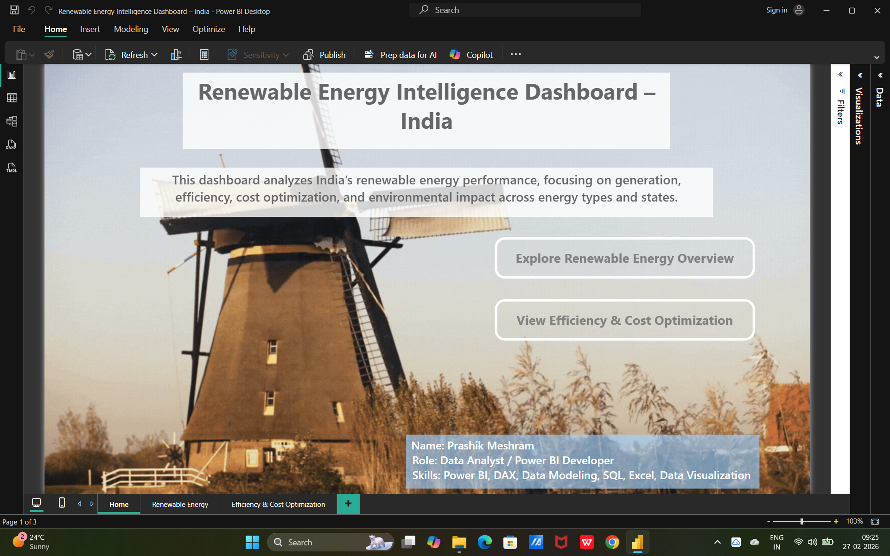
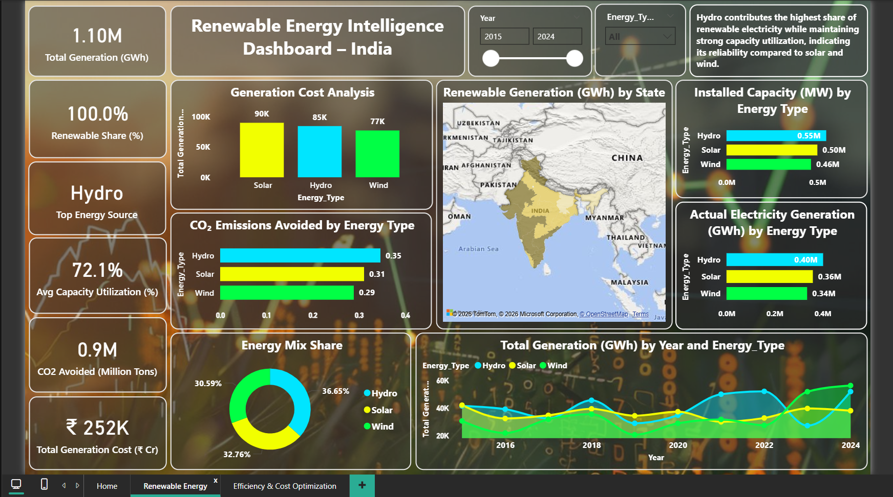
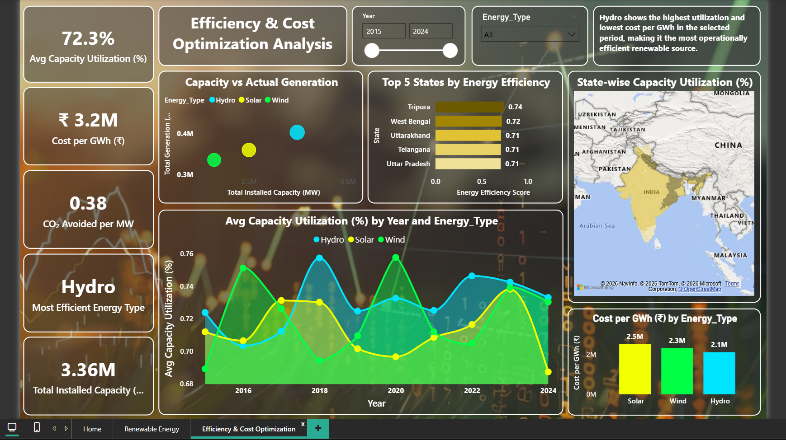

# 🌱 Renewable Energy Intelligence Dashboard – India

## 📊 Project Overview

The **Renewable Energy Intelligence Dashboard – India** is an interactive Power BI dashboard designed to analyze India's renewable energy sector using data visualization and business intelligence techniques. The dashboard provides insights into renewable energy generation, installed capacity, state-wise performance, and energy trends to support data-driven decision making.

---

## 🎯 Objectives

* Analyze renewable energy generation across India.
* Compare state-wise renewable energy performance.
* Track installed capacity and energy production trends.
* Identify top-performing renewable energy sources and regions.
* Present actionable insights through interactive visualizations.

---

## 🛠️ Tools & Technologies Used

* **Power BI**
* **Microsoft Excel**
* **Data Visualization**
* **Data Cleaning & Transformation**
* **DAX**
* **Power Query**

---

## 📂 Dataset

The dataset used for this project is included in this repository as an Excel file.

File:

* Renewable Energy Intelligence Dashboard – India - Excel.xlsx

---

## 📈 Dashboard Features

* State-wise Renewable Energy Analysis
* Renewable Energy Source Distribution
* Installed Capacity Analysis
* Trend Analysis
* Interactive Filters and Slicers
* KPI Cards for Quick Insights

---

## 💡 Key Insights

* Identifies leading states in renewable energy generation.
* Highlights renewable energy capacity trends.
* Compares different renewable energy sources.
* Enables interactive exploration of energy statistics.

---

## 📷 Dashboard Screenshots

### Dashboard Page 1

### Dashboard Page 2

### Dashboard Page 3

---

## 📁 Repository Contents

* Renewable Energy Intelligence Dashboard – India.pbix
* Renewable Energy Intelligence Dashboard – India - Excel.xlsx
* README.md

---

## 👨‍💻 Author

**Prashik Meshram**

Aspiring Data Analyst

Skills: SQL | Python | Power BI | Tableau | Excel
